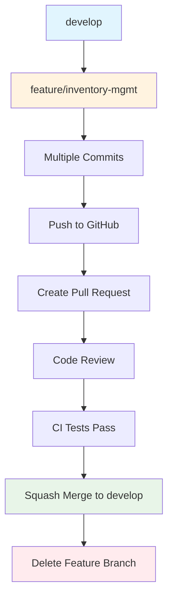
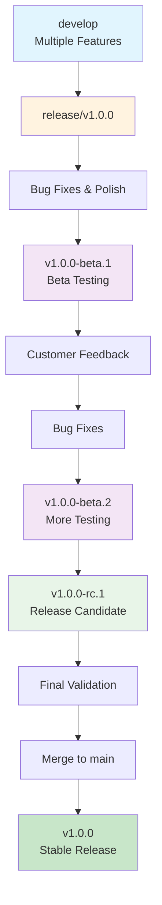
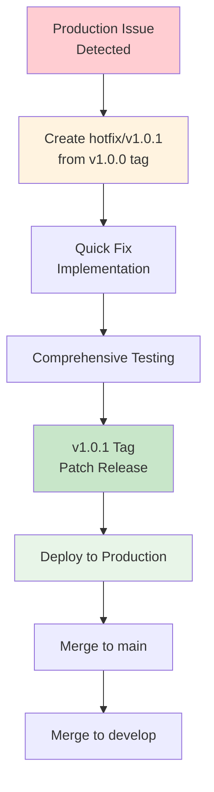

# Branch Konzept - Visueller Leitfaden

## Git Flow Übersicht

```
                    main (Production)
                      │
                      ├─── v1.0.0 (Tag)
                      │      │
                      │      └─── hotfix/v1.0.1
                      │             │
                      │             └─── v1.0.1 (Tag)
                      │
                      ├─── v1.1.0 (Tag)
                      │
                    develop (Integration)
                      │
                      ├─── feature/inventory-mgmt
                      │      │
                      │      ├─── feat: add product form
                      │      ├─── feat: category dropdown  
                      │      └─── feat: unit tests
                      │
                      ├─── feature/expiration-warnings
                      │      │
                      │      ├─── feat: warning logic
                      │      └─── feat: notification UI
                      │
                      └─── release/v1.0.0
                             │
                             ├─── v1.0.0-beta.1 (Tag)
                             ├─── v1.0.0-beta.2 (Tag)
                             └─── v1.0.0-rc.1 (Tag)
```

---

## Branch-Lebenszyklus

### 1. Feature Development Flow



**Zeitlicher Ablauf:**
```
Tag 1: Feature Branch erstellen
├── feature/inventory-mgmt von develop
├── Erste Commits (Grundstruktur)
└── Push für Backup

Tag 2-5: Entwicklung
├── Add product form component
├── Implement validation logic  
├── Add unit tests
├── Fix review feedback
└── Documentation updates

Tag 6: Integration
├── Final push
├── Create Pull Request
├── Code Review (1-2 Tage)
├── CI Tests (automatisch)
└── Squash Merge to develop
```

### 2. Release Preparation Flow



**Release Timeline (Beispiel):**
```
Woche 1: Release Branch
├── release/v1.0.0 von develop
├── Version Updates
├── Final Bug Fixes
└── Integration Testing

Woche 2: Beta Phase
├── v1.0.0-beta.1 Release
├── Beta Testing durch Kunden
├── Bug Reports sammeln
└── Kritische Fixes

Woche 3: Stabilisierung  
├── v1.0.0-beta.2 (mit Fixes)
├── Weitere Tests
├── v1.0.0-rc.1 (Release Candidate)
└── Final Validation

Woche 4: Production
├── Merge zu main
├── v1.0.0 Stable Release
├── Deployment
└── Monitoring
```

### 3. Hotfix Emergency Flow



**Hotfix Timeline (Emergency):**
```
Hour 1: Issue Detection
├── Critical bug reported
├── Impact assessment
├── Create hotfix branch
└── Assign developer

Hour 2-4: Fix Development
├── Reproduce issue
├── Implement minimal fix
├── Write regression test
└── Local validation

Hour 5-6: Testing & Release
├── Comprehensive testing
├── Security review
├── Create patch release
└── Deploy to production

Hour 7-8: Integration
├── Merge to main
├── Merge to develop
├── Monitor production
└── Post-mortem planning
```

---

## Branch Naming Conventions

### Feature Branches
```
feature/[category]-[short-description]

✅ Gut:
├── feature/inventory-add-product
├── feature/ui-responsive-design
├── feature/api-category-management
└── feature/auth-user-login

❌ Schlecht:
├── feature/stuff
├── feature/fixes
├── feature/john-work
└── feature/temp
```

### Release Branches
```
release/v[major].[minor].[patch]

✅ Beispiele:
├── release/v1.0.0
├── release/v1.1.0
├── release/v2.0.0
└── release/v1.2.0-beta
```

### Hotfix Branches
```
hotfix/v[major].[minor].[patch]

✅ Beispiele:
├── hotfix/v1.0.1
├── hotfix/v1.0.2
├── hotfix/v1.1.1
└── hotfix/v2.0.1-security
```

---

## Branch Merge Strategien

### 1. Feature → Develop (Squash Merge)

**Vor Squash Merge:**
```
feature/inventory-mgmt:
├── feat: add product form component
├── fix: validation logic bug
├── docs: update API documentation
├── test: add unit tests for form
├── fix: address PR review feedback
└── style: fix code formatting
```

**Nach Squash Merge:**
```
develop:
└── Feature: Add inventory management system (#15)
    └── Squashed commit with clean summary
```

**Vorteil:** Saubere Historie in develop, einzelne Commits verschwinden

### 2. Release → Main (Merge Commit)

**Release Branch:**
```
release/v1.0.0:
├── Feature: Inventory management (from develop)
├── Feature: Category system (from develop)  
├── Feature: Expiration warnings (from develop)
├── fix: minor UI polish
└── chore: update version to v1.0.0
```

**Main nach Merge:**
```
main:
├── Previous release commits
└── Merge release/v1.0.0 into main (v1.0.0)
    └── Alle Features dieser Version
```

**Vorteil:** Vollständige Release-Historie erhalten

### 3. Hotfix → Main/Develop (Fast-Forward)

**Hotfix:**
```
hotfix/v1.0.1:
└── fix: critical security vulnerability in login
```

**Nach Merge:**
```
main:
├── v1.0.0 release
└── fix: critical security vulnerability in login

develop:  
├── Current development work
└── fix: critical security vulnerability in login
```

**Vorteil:** Einfache Integration, keine Merge-Konflikte

---

## Konflikt-Resolution

### Häufige Merge-Konflikte

#### 1. Feature → Develop Konflikte
```bash
# Situation: Develop hat sich während Feature-Entwicklung geändert
git checkout feature/my-feature
git rebase develop

# Konflikte lösen
git add .
git rebase --continue

# Clean Feature für PR
git push --force-with-lease origin feature/my-feature
```

#### 2. Release → Main Konflikte
```bash
# Situation: Hotfix wurde parallel entwickelt
git checkout release/v1.0.0
git merge main

# Konflikte lösen (meist wenige)
git add .
git commit -m "Resolve merge conflicts with hotfix"
```

#### 3. Develop Synchronisation
```bash
# Nach Release: Develop mit Main synchronisieren
git checkout develop
git merge main

# Nach Hotfix: Develop mit Hotfix synchronisieren  
git merge hotfix/v1.0.1
```

---

## Branch Protection Regeln

### Main Branch Schutz

```yaml
Protection Rules für main:
├── ✅ Require pull request reviews before merging
│   ├── Required reviewers: 1
│   ├── Dismiss stale reviews: true
│   └── Require review from code owners: true
├── ✅ Require status checks to pass before merging
│   ├── Require branches to be up to date: true
│   ├── Status checks: CI Tests, Build
│   └── Require conversation resolution: true
├── ✅ Restrict pushes that create files
├── ✅ Restrict pushes that delete files  
└── ✅ Do not allow bypassing the above settings
```

### Develop Branch Schutz

```yaml
Protection Rules für develop:
├── ✅ Require pull request reviews before merging
│   ├── Required reviewers: 1
│   └── Dismiss stale reviews: false
├── ✅ Require status checks to pass before merging
│   ├── Status checks: CI Tests
│   └── Require branches to be up to date: true
├── ✅ Allow force pushes (für Rebase)
└── ✅ Allow deletions (für Branch Cleanup)
```

---

## Monitoring & Metriken

### Branch Health Monitoring

```bash
# Aktive Branches überwachen
gh api repos/maikhir/gefrierschrank-app/branches \
  --template '{{range .}}{{.name}} - {{.commit.commit.author.date}}{{"\n"}}{{end}}'

# Lange lebende Feature Branches identifizieren  
git for-each-ref --format='%(refname:short) %(committerdate)' refs/remotes/origin/feature

# Stale Branches finden (älter als 30 Tage)
git for-each-ref --format='%(refname:short) %(committerdate)' refs/remotes \
  | awk '$2 < "'$(date -d '30 days ago' '+%Y-%m-%d')'"'
```

### Release Metriken

```bash
# Release Frequency
git tag -l "v*" --sort=-version:refname | head -10

# Time between Releases  
git log --tags --simplify-by-decoration --pretty="format:%ai %d" | head -5

# Hotfix Rate (Patches per Major Release)
git tag -l "v1.0.*" | wc -l  # Anzahl Patches für v1.0
```

---

## Best Practices

### Do's ✅

1. **Feature Isolation**
   ```bash
   # Jedes Feature in eigenen Branch
   git checkout -b feature/specific-functionality
   ```

2. **Regelmäßige Updates**
   ```bash
   # Feature Branch regelmäßig mit develop synchronisieren
   git rebase develop
   ```

3. **Aussagekräftige Commits**
   ```bash
   git commit -m "feat: add inventory form validation with error messages"
   ```

4. **Tests vor Merge**
   ```bash
   # Lokale Tests vor PR
   ./mvnw test && npm test
   ```

5. **Branch Cleanup**
   ```bash
   # Nach Merge: Branch löschen
   git branch -d feature/completed-feature
   ```

### Don'ts ❌

1. **Direkte Commits zu Main**
   ```bash
   # ❌ Niemals direkt zu main pushen
   git push origin main
   ```

2. **Lange lebende Feature Branches**
   ```bash
   # ❌ Vermeiden: Branches älter als 2 Wochen
   git log --since="2 weeks ago" feature/old-branch
   ```

3. **Merge ohne Tests**
   ```bash
   # ❌ Niemals ohne CI Tests mergen
   ```

4. **Forcierte Pushes zu shared Branches**
   ```bash
   # ❌ Nie force push zu develop/main
   git push --force origin develop
   ```

5. **Vage Commit Messages**
   ```bash
   # ❌ Schlechte Commit Messages
   git commit -m "fix stuff"
   git commit -m "changes"
   ```

---

## Tooling & Automation

### Git Hooks

```bash
# pre-commit Hook: Tests ausführen
#!/bin/sh
./mvnw test && npm test

# commit-msg Hook: Message Format prüfen
#!/bin/sh
grep -E "^(feat|fix|docs|style|refactor|test|chore): .{1,50}" "$1"
```

### Branch Automation Scripts

```bash
# new-feature.sh
#!/bin/bash
FEATURE_NAME=$1
git checkout develop
git pull origin develop
git checkout -b feature/$FEATURE_NAME
echo "✅ Feature branch 'feature/$FEATURE_NAME' created"

# cleanup-branches.sh  
#!/bin/bash
git branch --merged develop | grep -E "feature/" | xargs -n 1 git branch -d
echo "✅ Merged feature branches cleaned up"
```

### GitHub CLI Workflows

```bash
# Quick PR Creation
alias pr-create="gh pr create --base develop --fill"

# Release Status Check
alias release-status="gh release list | head -5"

# Branch Overview
alias branch-status="gh api repos/:owner/:repo/branches --template '{{range .}}{{.name}}: {{.commit.commit.author.date}}{{\"\\n\"}}{{end}}'"
```

---

## Zusammenfassung

Das Branch-Konzept bietet:

✅ **Klare Trennung** zwischen Entwicklung, Testing und Produktion
✅ **Parallele Feature-Entwicklung** ohne Interferenz  
✅ **Strukturierte Release-Zyklen** mit Beta Testing
✅ **Schnelle Hotfix-Prozesse** für kritische Issues
✅ **Automatisierte Qualitätssicherung** durch Protected Branches
✅ **Skalierbare Workflows** für wachsende Teams

Die Visualisierungen und Beispiele in diesem Dokument helfen bei der praktischen Umsetzung des Git Flows in der täglichen Entwicklungsarbeit.