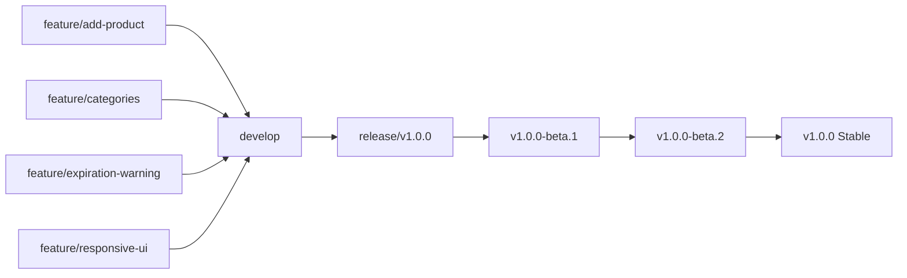

# Git Workflow & Release Management Konzept

## Überblick

Die Gefrierschrank-App verwendet ein **modifiziertes Git Flow Modell** mit Fokus auf:
- ✅ **Feature-basierte Entwicklung** in isolierten Branches
- ✅ **Beta Testing** über Pre-releases für Kundenfeedback
- ✅ **Stabile Releases** mit Hotfix-Unterstützung
- ✅ **Automatisierte CI/CD** mit GitHub Actions

---

## Branch-Konzept

### Branch-Hierarchie

```
main (Production)
├── hotfix/v1.0.1 (Critical fixes)
├── release/v1.0.0 (Release preparation)
└── develop (Integration)
    ├── feature/inventory-management
    ├── feature/expiration-warnings
    └── feature/responsive-design
```

### Branch-Typen und Zweck

| Branch Type | Zweck | Merge Target | Lebensdauer |
|-------------|-------|--------------|-------------|
| `main` | **Produktionscode** - Immer deployable | - | Permanent |
| `develop` | **Integration** - Feature-Sammlung für nächste Version | main | Permanent |
| `feature/*` | **Neue Features** - Isolierte Entwicklung | develop | Temporär |
| `release/*` | **Release-Vorbereitung** - Stabilisierung & Beta Testing | main + develop | Temporär |
| `hotfix/*` | **Kritische Fixes** - Schnelle Produktions-Bugfixes | main + develop | Temporär |

---

## Detaillierter Workflow

### 1. Feature-Entwicklung

#### Schritt 1: Feature Branch erstellen
```bash
# Von develop branchen
git checkout develop
git pull origin develop
git checkout -b feature/add-product-form

# Feature entwickeln
# Mehrere Commits möglich
git add .
git commit -m "Add product form validation"
git commit -m "Implement category dropdown"
git commit -m "Add unit tests for product form"
```

#### Schritt 2: Pull Request erstellen
```bash
# Feature Branch pushen
git push origin feature/add-product-form

# PR über GitHub CLI erstellen
gh pr create \
  --base develop \
  --title "Feature: Add Product Form with Validation" \
  --body "
## Feature Description
- Implements new product addition form
- Adds category dropdown and validation
- Includes comprehensive unit tests

## Checklist
- [x] Unit tests written and passing
- [x] Code reviewed
- [x] Documentation updated
- [x] Responsive design verified

Closes #1
"
```

#### Schritt 3: Code Review & Merge
```bash
# Nach Review und Approval
# Squash Merge in develop
# Branch automatisch gelöscht
```

### 2. Release-Prozess

#### Schritt 1: Beta Release Vorbereitung
```bash
# Release Branch von develop erstellen
git checkout develop
git pull origin develop
git checkout -b release/v1.0.0

# Finale Tests und kleine Bugfixes
git commit -m "Fix minor UI issues for v1.0.0"
git commit -m "Update version numbers"
```

#### Schritt 2: Beta Release erstellen
```bash
# Beta Tag erstellen
git tag v1.0.0-beta.1
git push origin v1.0.0-beta.1

# ✅ Automatischer GitHub Workflow startet:
# 1. Build Backend JAR
# 2. Generiert Beta Release Notes aus FEATURES.md
# 3. Erstellt GitHub Pre-release
# 4. Markiert als "Beta" für Kundentests
```

#### Schritt 3: Beta Testing Phase
- Kunden testen Beta Version
- Bug Reports werden gesammelt
- Kritische Bugs in Release Branch gefixt
- Weitere Beta Versionen: `v1.0.0-beta.2`, `v1.0.0-rc.1`

#### Schritt 4: Stable Release
```bash
# Wenn Beta stabil ist
git checkout main
git merge release/v1.0.0

# Stable Release Tag
git tag v1.0.0
git push origin v1.0.0

# ✅ Automatischer GitHub Workflow:
# 1. Erstellt Stable Release (nicht Pre-release)
# 2. Markiert als "Latest Release"
# 3. Generiert Production Release Notes
# 4. Fügt Hotfix-Support Hinweise hinzu

# Zurück zu develop mergen
git checkout develop
git merge main
```

### 3. Hotfix-Prozess

#### Schritt 1: Kritischer Bug in Production
```bash
# Hotfix Branch vom Production Tag erstellen
gh workflow run hotfix.yml \
  -f base_version=v1.0.0 \
  -f hotfix_description="Fix critical login security issue"

# Oder manuell:
git checkout v1.0.0
git checkout -b hotfix/v1.0.1
```

#### Schritt 2: Bugfix implementieren
```bash
# Kritischen Bug fixen
git commit -m "Fix critical login security vulnerability"
git commit -m "Add regression tests for login security"

# Umfassend testen
./backend/mvnw test
```

#### Schritt 3: Hotfix Release
```bash
# Patch Release Tag
git tag v1.0.1
git push origin v1.0.1

# ✅ Automatische Release Creation
# Release Notes: "Hotfix Release v1.0.1"

# In main und develop mergen
git checkout main
git merge hotfix/v1.0.1
git checkout develop
git merge hotfix/v1.0.1
```

---

## Release-Zyklen und Versionierung

### Semantic Versioning (SemVer)

```
v1.0.0          ← Stable Release (Latest)
├── v1.0.1      ← Hotfix (Bugfix)
├── v1.0.2      ← Hotfix (Security)
└── v1.1.0      ← Minor Release (New Features)
    ├── v1.1.0-beta.1    ← Beta Testing
    ├── v1.1.0-beta.2    ← Beta Bugfixes
    └── v1.1.0-rc.1      ← Release Candidate
```

### Release-Arten

#### 🧪 Beta Releases (Pre-release)
**Zweck:** Kundenfeedback und Testing
```bash
git tag v1.0.0-beta.1    # Erste Beta
git tag v1.0.0-beta.2    # Beta mit Bugfixes
git tag v1.0.0-rc.1      # Release Candidate
```

**Eigenschaften:**
- GitHub "Pre-release" Badge
- Beta-spezifische Release Notes
- Warnung für Produktionsumgebung
- Feedback-Aufforderung

#### 🚀 Stable Releases (Production)
**Zweck:** Produktive Nutzung
```bash
git tag v1.0.0           # Major Release
git tag v1.1.0           # Minor Release
git tag v1.0.1           # Patch Release
```

**Eigenschaften:**
- GitHub "Latest release" Badge
- Vollständige Release Notes
- Hotfix-Support garantiert
- Produktions-ready

---

## Automatisierte Workflows

### CI/CD Pipeline (`ci.yml`)

**Trigger:**
- Push zu `main` oder `develop`
- Pull Requests zu `main`

**Aktionen:**
```yaml
jobs:
  test-backend:     # Spring Boot Tests
  test-frontend:    # Frontend Tests  
  docker-build:     # Nur bei main Branch
```

### Release Workflow (`release.yml`)

**Trigger:** Git Tags `v*`

**Intelligente Release Notes:**
```bash
# Beta Release Notes
if [[ "$VERSION" == *"beta"* ]]; then
  echo "🧪 Beta Release - Testing Guidelines"
  echo "⚠️ Not for production use"
fi

# Stable Release Notes  
else
  echo "🚀 Stable Release Features"
  echo "🔧 Hotfix Support Available"
fi
```

### Hotfix Workflow (`hotfix.yml`)

**Trigger:**
- Push zu `hotfix/*` oder `release/*`
- Manual Workflow Dispatch

**Spezielle Validierung:**
```yaml
steps:
  - name: Run Security Scan
  - name: Validate Hotfix Readiness
  - name: Comprehensive Testing
```

---

## Feature → Release Mapping

### Version 1.0.0 - Core Features


### Beispiel Release-Zyklus
```bash
# Woche 1-4: Feature Development
feature/inventory-management → develop
feature/category-management → develop  
feature/expiration-warnings → develop

# Woche 5: Release Vorbereitung
develop → release/v1.0.0 → v1.0.0-beta.1

# Woche 6: Beta Testing
Customer Feedback → Bugfixes → v1.0.0-beta.2

# Woche 7: Stable Release
Final Testing → v1.0.0-rc.1 → v1.0.0 Stable

# Kontinuierlich: Hotfixes
Critical Bugs → hotfix/v1.0.1 → v1.0.1
```

---

## Praktische Kommandos

### Tägliche Entwicklung
```bash
# Neues Feature starten
git checkout develop && git pull origin develop
git checkout -b feature/my-feature

# Feature fertigstellen  
git push origin feature/my-feature
gh pr create --base develop

# Nach PR Merge
git checkout develop && git pull origin develop
git branch -d feature/my-feature
```

### Release Management
```bash
# Beta Release
git checkout develop
git tag v1.0.0-beta.1
git push origin v1.0.0-beta.1

# Stable Release
git checkout main
git merge develop  
git tag v1.0.0
git push origin v1.0.0

# Hotfix
git checkout v1.0.0
git checkout -b hotfix/v1.0.1
# Fix bugs
git tag v1.0.1
git push origin v1.0.1
```

### Status Checking
```bash
# Aktuelle Branch Info
git status
git log --oneline -10

# Remote Branches
git branch -r

# Tags anzeigen
git tag -l "v*" --sort=-version:refname
```

---

## Qualitätssicherung

### Branch Protection Rules

#### Main Branch
- ✅ PR Reviews erforderlich
- ✅ Status Checks müssen bestehen
- ✅ Branch muss aktuell sein
- ✅ Direkte Pushes verboten

#### Develop Branch  
- ✅ PR Reviews erforderlich
- ✅ CI Tests müssen bestehen
- ✅ Force Pushes erlaubt (Rebase)

### Automated Checks
```yaml
# Jeder PR wird geprüft:
✓ Backend Tests (JUnit)
✓ Frontend Tests (Jest)
✓ Build Validierung
✓ Code Quality (optional: SonarQube)
✓ Security Scan (optional: Snyk)
```

---

## Troubleshooting

### Häufige Szenarien

#### "Hotfix muss schnell deployed werden"
```bash
# 1. Hotfix Branch erstellen
gh workflow run hotfix.yml -f base_version=v1.0.0

# 2. Bugfix committen
git commit -m "Fix critical issue"

# 3. Sofort releasen
git tag v1.0.1
git push origin v1.0.1
```

#### "Feature muss aus Release entfernt werden"
```bash
# 1. In release branch committen
git checkout release/v1.0.0
git revert <feature-commit-hash>

# 2. Oder develop ohne Feature neu branchen
git checkout develop
git checkout -b release/v1.0.0-revised
```

#### "Beta hat kritische Bugs"
```bash
# 1. Bugfix in release branch
git checkout release/v1.0.0
git commit -m "Fix critical beta bug"

# 2. Neue Beta
git tag v1.0.0-beta.2
git push origin v1.0.0-beta.2
```

---

## Zusammenfassung

Dieses Git Workflow Konzept bietet:

✅ **Saubere Feature-Isolation** durch Branch-Strategie
✅ **Qualitätssicherung** durch automatisierte Tests
✅ **Kundenfeedback** durch Beta Release System  
✅ **Schnelle Hotfixes** für kritische Bugs
✅ **Nachvollziehbare Releases** mit automatischen Release Notes
✅ **Skalierbare Entwicklung** für wachsende Teams

Das System unterstützt sowohl agile Feature-Entwicklung als auch stabile Production-Releases mit minimaler manueller Arbeit.